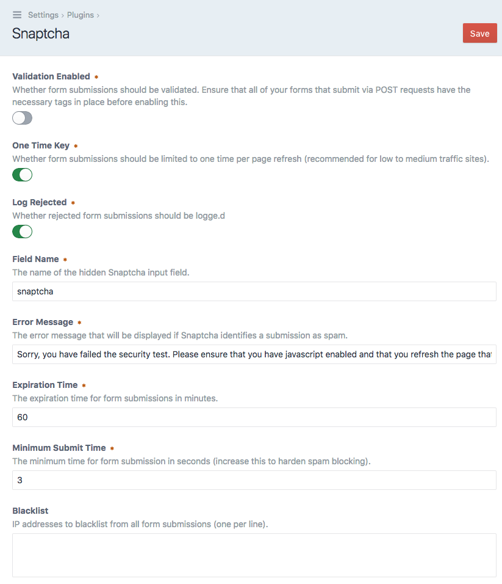

# Snaptcha Plugin for Craft CMS 3

Snaptcha is an invisibla CAPTCHA that automatically validates forms and prevents spam bots from submitting to your [Craft CMS](https://craftcms.com/) site.

Snaptcha (Simple Non-obtrusive Automated Public Turing test to tell Computers and Humans Apart) will validate all POST requests to the front-end of your site, meaning that it will work with any form and any plugin. Note that since this will affect all POST requests, you must add the required template tag before enabling validation (see usage below).

## License

This plugin requires a commercial license which can be purchased through the Craft Plugin Store. The license fee is $29 plus $9 per subsequent year for updates (optional).

## Requirements

Craft CMS 3.0.0 or later.

## Installation

To install the plugin, search for "Snaptcha" in the Craft Plugin Store, or install manually using composer.

        composer require putyourlightson/craft-snaptcha

## Usage

After installing the plugin, go to the plugin settings page. Snaptcha validation is disabled by default so that you can first add the required template tag to your forms. Once you have done this you can enable Snaptcha validation.

Add the following template tag to every form that submits a POST request to your site. This will output a hidden input field along with some JavaScript code.

    {{ craft.snaptcha.field }}      // Outputs a hidden input field
    
If you are submitting a POST request through AJAX then you can get the field name and value as follows.

    {{ craft.snaptcha.fieldName }}       // Outputs the name of the field
    
    {{ craft.snaptcha.fieldValue }}      // Outputs the value of the field

You can optionally use the `getField` and `getFieldValue` methods to pass in configuration values that will override the default values in the plugin settings.

    
    
    {{ craft.snaptcha.getField(config) }}         // Outputs a hidden input field
    
    {{ craft.snaptcha.getFieldValue(config) }}    // Outputs the value of the field
    
Enabling the One Time Key setting will restrict the number of times that a form can be submitted to one time per page refresh. This is a strong security measure and is recommended for low to medium traffic sites. For high traffic sites, disabling this will prevent the database table that the plugin uses from getting too big. 

## Testing Snaptcha

If you want to test or see how Snaptcha works on your site then navigate to one of your forms, open your browser's inspector and delete the input field that Snaptcha inserted. It will usually be inside your form's markup and will have an ID that begins with the prefix in your extension settings (`snaptcha` by default). After deleting the input field, submit the form and the error message from your plugin settings should appear. 

<small>Created by [PutYourLightsOn](https://putyourlightson.com/).</small>
